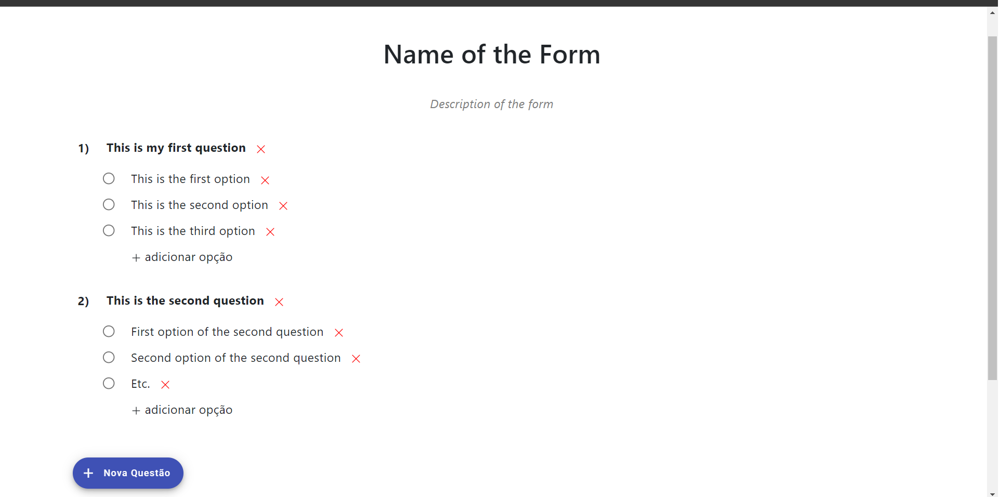
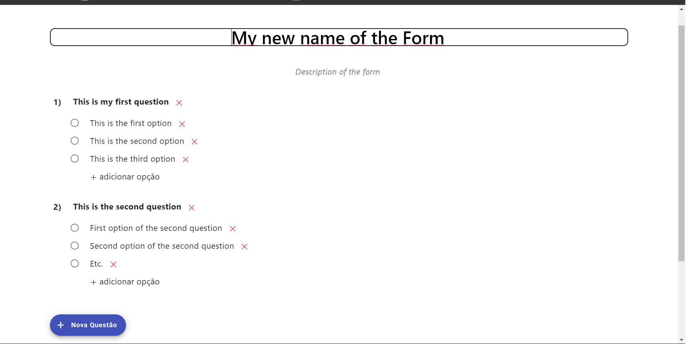
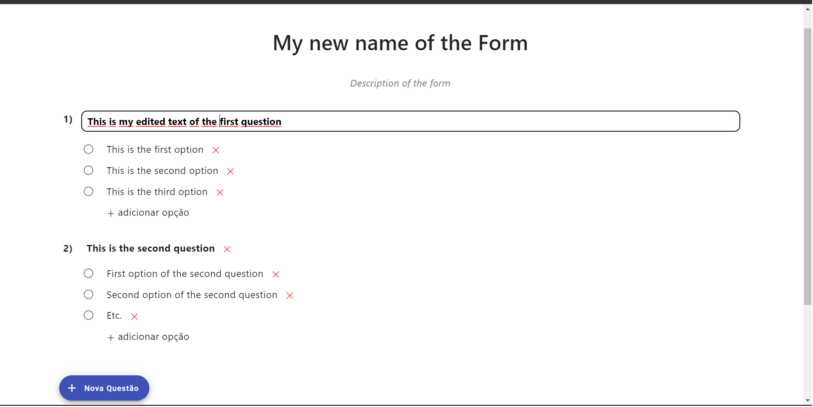

# Questionnaire 

This project is a system based on Angular and Django Rest for editing questionnaires and sharing them with users à lá google forms. For instructions on how to install and run the system, refer to the front-end and back-end specific instructions. 

The following figures show the form editor. Note as all text fields can be easily editted on the interface.

